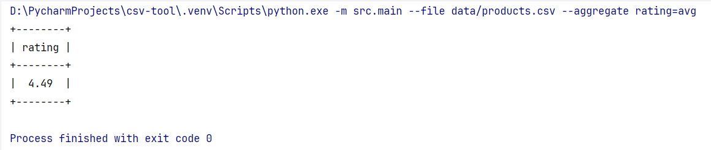

# CSV-tool

Небольшая CLI-утилита для «быстрой аналитики» CSV-файлов.

Поддерживает:

* фильтрацию (`--where`) по одному условию с операторами `=`, `<`, `>`
* агрегации (`--aggregate`) `min`, `max`, `avg` по одной числовой колонке

Все сделано максимально просто, но с прицелом на расширяемость ― новые
агрегаторы или дополнительные команды можно подключать, не трогая
существующий код.

---

## Установка

```bash
python -m venv .venv
source .venv/bin/activate  # Windows: .venv\Scripts\activate
pip install -r requirements.txt
```

## Примеры запуска

```bash
# средняя оценка всех товаров
python -m src.main --file data/products.csv --aggregate "rating=avg"
```



```bash
# минимальный рейтинг среди Xiaomi
python -m src.main --file data/products.csv --where "brand=xiaomi" --aggregate "rating=min"
```


```bash
# просто отфильтровать, без агрегации
python -m src.main --file data/products.csv --where "price>500"
```


## Пример ошибки

Неверное имя агрегатора сразу сообщает об ошибке:

```bash
python -m src.main --file data/products.csv --aggregate "rating=median"
```


## Запуск тестов

```bash
pytest --cov
```

